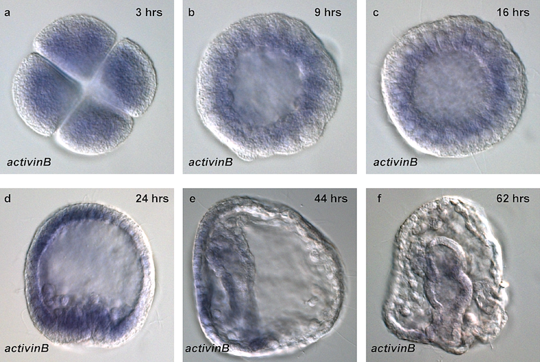
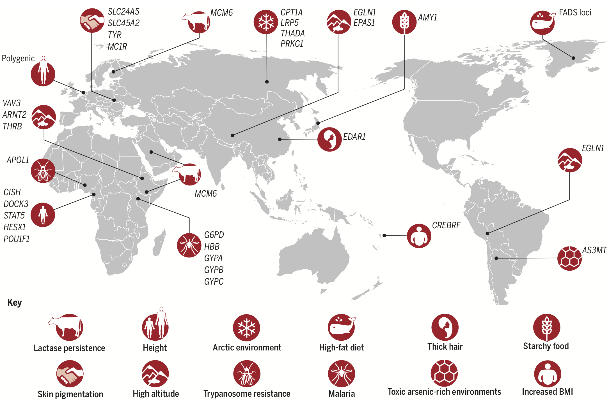
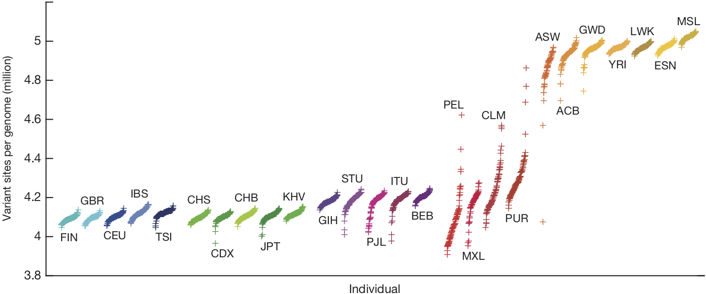
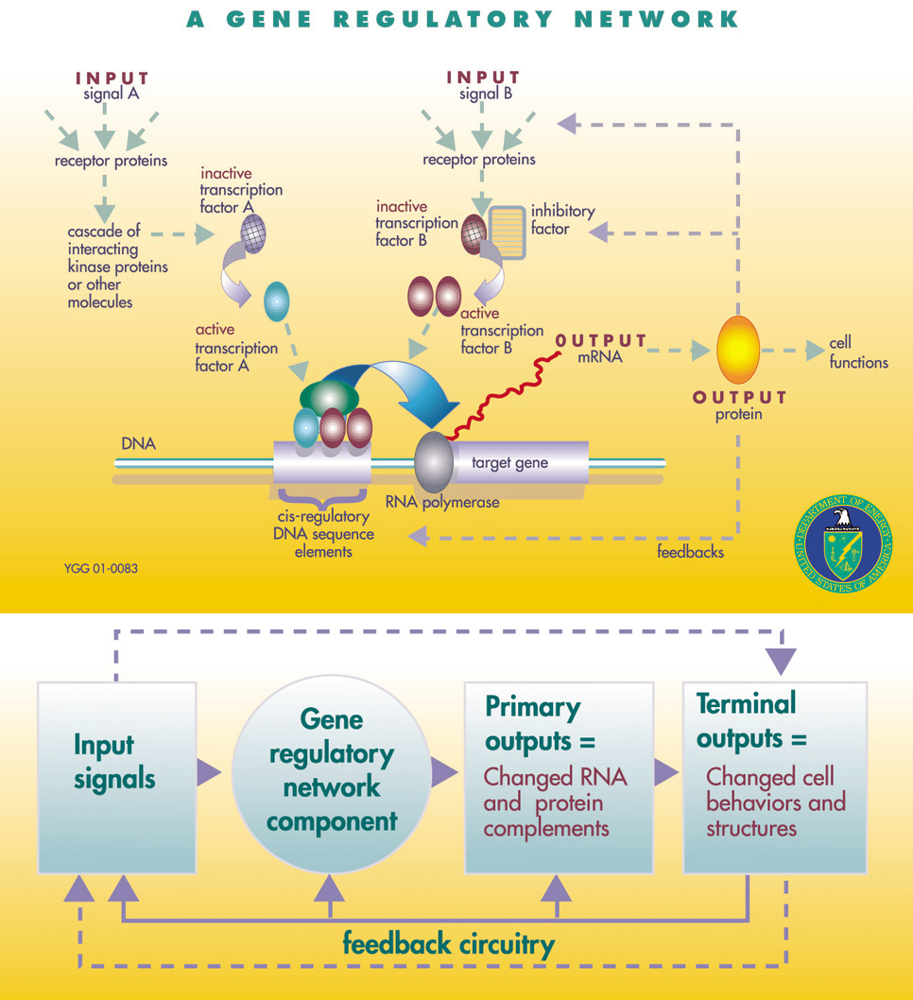
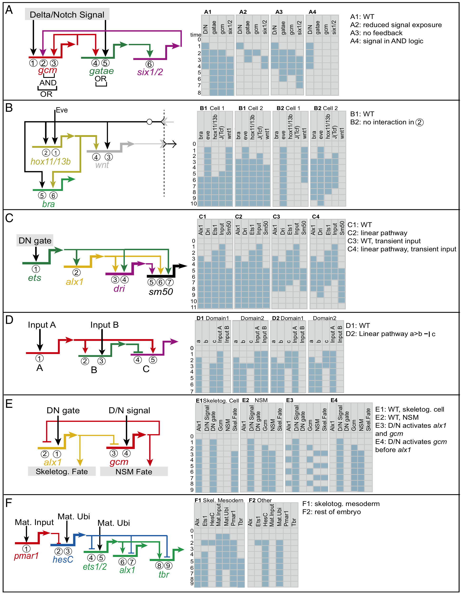
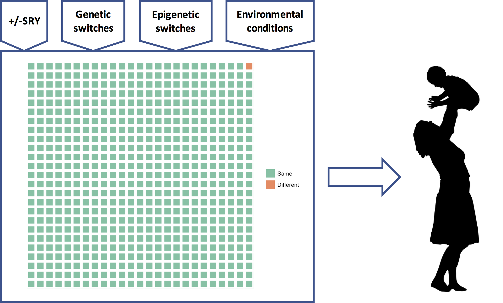

```{r setup, include=FALSE}
knitr::opts_chunk$set(echo = FALSE)
```

The human genome, for many, represents differences, *essential* differences. The real spectre that such differences fuel [racism, sexism, and eugenics](https://en.wikipedia.org/wiki/Biological_determinism) has lead much of academia to downplay or even deny a role for the genome in human affairs. 

Geneticist David Reich confronted this spectre in his recent [New York Times Op-Ed](https://www.nytimes.com/2018/03/23/opinion/sunday/genetics-race.html) where he raised the alarm that scientists are on the verge of discovering genetic differences in intelligence, cognition, and behavior among the races:

>So how should we prepare for the likelihood that in the coming years, genetic studies will show that many traits are influenced by genetic variations, and that these traits will differ on average across human populations? It will be impossible — indeed, anti-scientific, foolish and absurd — to deny those differences.

I agree. A study of a large European sample, just published in Nature Genetics, found numerous genetic variants associated with intelligence ([Savage et al. 2018](https://doi.org/10.1038/s41588-018-0152-6)). Another just-published study found that social mobility was associated with education-linked genetic variants ([Belsky et al. 2018](https://doi.org/10.1073/pnas.1801238115)). It is not hard to imagine that similar studies using global samples might find even more such variants, and that the distribution of these variants might differ across populations.[^3]

[^3]: Regarding the construct "intelligence," my views correspond pretty closely to Cosma Shalizi's, see, e.g., [here](http://bactra.org/weblog/494.html), [here](http://bactra.org/weblog/495.html), [here](http://bactra.org/weblog/520.html), and [here](http://bactra.org/weblog/523.html). A taste: "If we must argue about the mind in terms of early-twentieth-century psychometric models, I'd suggest that Thomson's is a lot closer than the factor-analytical ones to what's suggested by the evidence from cognitive psychology, neuropsychology, functional brain imaging, general evolutionary considerations and, yes, evolutionary psychology (which I think well of, when it's done right): that there are lots of mental modules, which are highly specialized in their information-processing, and that almost any meaningful task calls on many of them, their pattern of interaction shifting from task to task."

Reich suggests we can avoid the racist implications of such discoveries by learning from the example of the biological differences between males and females:

>The differences between the sexes are far more profound than those that exist among human populations, reflecting more than 100 million years of evolution and adaptation. Males and females differ by huge tracts of genetic material — a Y chromosome that males have and that females don’t, and a second X chromosome that females have and males don’t.

>...

>How do we accommodate the biological differences between men and women? I think the answer is obvious: We should both recognize that genetic differences between males and females exist and we should accord each sex the same freedoms and opportunities regardless of those differences.

According to Reich, although we're learning more about our genetic differences every day, when it comes to freedoms and opportunities we should just ignore all these new discoveries. 

I'm skeptical this approach will keep sexists and racists at bay.

One problem with Reich's attempt at an analogy between sex and race is that his account of genetic differences between the sexes is deeply misleading. More importantly, Reich, though rightly drawing our attention to new and perhaps unsettling discoveries about the genome, is making the same fatal error many of us academics have made. By downplaying or ignoring the profound role of the genome in human affairs specifically, we have left a scientific vacuum that will be filled with racist and sexist claptrap.

Here I want to sketch the scientific model of the genome that should fill that vacuum. Many of the key features of this model emerged from research on sea urchin development, which began in the 1840's, more than a decade before Darwin published *On the Origin of Species*.

```{r fig-urchin, echo=F, fig.cap="Sea urchin development. Blue color indicates distribution of mRNA transcripts of activinB, a key signaling protein. Figure from [Sethi et al. 2009](https://doi.org/10.1371/journal.pbio.1000029.g007)."}

```

<!-- Spoiler alert: human genetic similarities vastly outweigh genetic differences (and when it comes to sex, there are basically no genetic differences).  -->

Before tackling the genetics of sex and sea urchin development, though, let's first get a handle on Reich's scientific perspective on the genetic basis of race.

<!-- If men are innately better at cave man things, and women at cave women things, why should I hire women to do cave man things? And if that logic holds for sex, why not race? -->

# Human genetic differences

Richard Lewontin famously [argued](https://doi.org/10.1007/978-1-4684-9063-3_14) that because the vast majority of human genetic variation is within populations and not between them, racial classification is of no "genetic or taxonomic significance." 

I used to teach this, but it's wrong. 

[Edwards (2003)](https://doi.org/10.1002/bies.10315), citing earlier analyses that Lewontin should have known about (and probably did), including those of Cavalli-Sforza and himself in the 1960's and stretching back to Fisher in the 1920's, noted that Lewontin had made a profound mistake:

>[Lewontin's] conclusions are based on the old statistical fallacy of analysing data on the assumption that it contains no information beyond that revealed on a locus-by-locus analysis, and then drawing conclusions solely on the results of such an analysis. The ‘taxonomic significance’ of genetic data in fact often arises from correlations amongst the different loci, for it is these that may contain the information which enables a stable classification to be uncovered.

Correlations among genetic loci show clear, unmistakable population structure that more or less corresponds to what most Westerners think of when they think of race (e.g., African, Asian, and European):

```{r fig-pca, echo=F, fig.cap="Principal components analysis of population structure in 554 individuals. First two principal components (PCs) are shown here. Each individual is represented by one dot and the color label corresponding to their self-identified population origin. The percentage of the variation in genetic distances explained by each PC is shown on the axes. Figure and caption from [Xing et al. 2009](https://doi.org/10.1101/gr.085589.108)."}
knitr::include_graphics("F2.large.jpg")
```

```{r fig-ancestry, echo=F, fig.cap="Regional ancestry inferred with the frappe program at K = 7 (13) and plotted with the Distruct program (31). Each individual is represented by a vertical line partitioned into colored segments whose lengths correspond to his/her ancestry coefficients in up to seven inferred ancestral groups. Population labels were added only after each individual's ancestry had been estimated; they were used to order the samples in plotting. Figure and caption from [Li et al. 2009](https://doi.org/10.1126/science.1153717)."}
knitr::include_graphics("ancestry.jpg")
```

Discerning population structure from genetic variation works best, however, when analyses are restricted to variation that is not under selection, the >90% of the genome that is "junk," i.e., has no influence on the phenotype (*non-functional* DNA). The genetic basis of "Race," in this case, cannot have anything to do with racial traits (and there are critiques of the genetic clustering algorithms, e.g., [Lawson et al. 2018](https://doi.org/10.1101/066431)). I [blog about this here](/2019/07/27/about-90-of-the-genome-is-junk-which-is-very-informative-about-ancestry-but-says-little-about-biology/).

There are also population differences, though, in the fraction of the genome that actually does something (*functional* DNA, currently estimated at about 8.2% of the entire genome; [Rands et al. 2014](https://doi.org/10.1371/journal.pgen.1004525)). Some of those differences represent adaptations to local environmental conditions:

```{r fig-adaptations, echo=F, fig.cap="Examples of human local adaptations, each labeled by the phenotype and/or selection pressure, and the genetic loci under selection. Figure and caption from [Fan et al. (2016)](https://doi.org/10.1126/science.aaf5098)."}

```

And some differences reflect population-specific disease risk: the dramatic population expansions that have occurred since modern humans left Africa have resulted in large number of rare, and probably somewhat deleterious, mutations that tend to be population-specific ([Keinan and Clark 2012](https://doi.org/10.1126/science.1217283)). 

Despite their disagreements, Lewontin, Edwards, Cavalli-Sforza, and Reich all focus on genetic *differences*, the 4-5 million variant sites that we now know exist in each human genome:

```{r fig-variants, echo=F, fig.cap="Variant sites per genome, relative to the reference human genome. Each symbol is one genome. Organized by population, and sorted by the number of variants. Figure from [The 1000 Genomes Project Consortium, 2015](https://doi.org/10.1038/nature15393)."}

```


Population differences in functional DNA, in particular, are the basis of Reich's warning that, if it hasn't already, science will eventually produce evidence of "substantial biological differences among human populations."

The question is, substantial relative to what?

# Human genetic similarities

Four-to-five million variants in each human genome sounds like a lot, until you realize that the human genome has about 3 billion nucleotides (bases), each of which could vary. Thus (somewhat naively) only about 0.0013--0.0016 of each genome varies. (The story is complicated by structural variants. See this footnote[^1].)

This means that all the genetic information about "race" --- the population differences in demography, history, and adaptive and maladaptive differences --- as well as individual differences, comes from a very small fraction of the genome, represented here by the orange square:

```{r fig-waffle, echo=F, message=F, warning=F, fig.cap="The fraction of the genome that differs between any two individuals. Different parts of the genome vary in different individuals, of course, and these differences are distributed across the genome."}
# 5e6/3e9 variants
waffle::waffle(c(Same = 624, Different = 1), rows = 25)
```

What is striking, at least to me, is not our "substantial biological differences" but our substantial biological similarities. Reich can only conclude that our differences are substantial by ignoring all the green squares.

There is a good reason, though, why Reich and many other geneticists have ignored all the green squares and focused on the orange one: it's much easier to analyze. In science, to determine if X is a *cause* of Y, which typically requires that we change X and see if Y changes, we instead often start by determining if differences in X *correlate* with differences in Y. This, of course, requires that there are differences in X and Y to begin with.

When it comes to the orange square, nature has already set up the experiment for us. We simply need to match the 4-5 million genetic differences that already exist, to the geographical or heritable phenotypic differences that already exist. In practice this is not so simple (far from it), but the rapidly expanding number of complete genome sequences from populations around the world have rapidly expanded our ability to match genetic variants to heritable phenotypic variants such as differences in eye, hair, and skin color.

Deciphering the biological "meaning" of all the green squares, on the other hand, faces immense conceptual and technical challenges. How does one determine which of the hundreds of millions of bases in functional DNA that don't vary are responsible for the different functional parts of phenotype, such as hearts, livers, and lungs, that also don't vary? *A priori*, any of the green squares could be involved in the development and functioning of any part (or all) of the phenotype. 

Where to start?

The headlines about exciting discoveries in the orange square and the near absence of the same regarding each and every green square, have led the public, and many scientists too, to equate the orange square with the genome, and all but ignore the green squares. This imbalance, evident in Reich's own op-ed, will "invite the racist misuse of genetics" that Reich rightly fears.

Here I want to give a small taste of the science to decode the green squares that has been slow-cooking for decades, but hasn't generated sexy headline after sexy headline because it involves, e.g., embryonic development in critters like sea urchins, fruit flies, frogs, nematodes, and mice, or arcane cellular functions like the xenobiotic induction of cytochrome P450 enzymes via nuclear PXR and CAR receptor activation in hepatocytes. 

<!-- Because "racial" differences in the brain and behavior are some of the most radioactive topics in all of science, the genome itself has become something of a pariah. Rather than dancing around the influence of genes on behavior (and everything else), however, there is a good scientific case to be made to *identify* the essence of the human species with the quarter of a billion nucleotides that have phenotypic effects[^2], to go all in on the genome. -->

<!-- [^2]: Of the 3 billion nucleotides in the human genome, it is currently estimated that 8.2%, or 246 million nucleotides, are conserved, i.e., have an effect on the phenotype and are therefore subject to purifying natural selection [(Rands et al. 2014)](https://doi.org/10.1371/journal.pgen.1004525). -->

# The genetic program (the green squares)

It has been recognized since antiquity that a seed autonomously develops into the same type of plant that produced the seed, and an egg into the same type of animal that produced the egg. We now know that seeds and eggs are single cells that contain an entire genome. Because adaptations evolve by the natural selection of DNA sequence variants, the functionality of an organism --- it's heart, liver, lungs, bones, muscles, etc. --- is somehow encoded in its genome, and that functionality is “constructed” during development.

As the organism develops via cell division, the entire genome is copied into each daughter cell; hence, every cell (with a few exceptions) contains a complete and identical copy of the genome. During development, daughter cells begin to differentiate into different types. Since the genome has not changed, yet encodes the functionality of, e.g., neural vs. epithelial cells, it must be the case that different parts of the genome, and different combinations of those parts, are involved in the development of the different cell types. 

[Jacob and Monad's (1961)](https://doi.org/10.1016/B978-0-12-460482-7.50042-7) Nobel prize winning discovery that a protein produced by one gene could regulate the expression of a different gene was a key breakthrough in understanding how different parts of the genome encoded different cellular functions. Moreover, this regulatory effect depended on environmental signals. Specifically, Jacob and Monad discovered a genetically encoded regulatory "circuit" in the bacteria *E. coli*, the [*lac* operon](https://en.wikipedia.org/wiki/Lac_operon), which produced an enzyme to metabolize lactose, a less valuable food, only if (1) lactose was present and (2) glucose, a more valuable food, was not. It turned out that such regulatory effects aren't rare. Instead, they're the whole enchilada.

Based on this discovery, and the insight that similar regulatory mechanisms were operating during the development of the organism, [Jacob and Monad (1961)](https://doi.org/10.1016/B978-0-12-460482-7.50042-7) and [Mayr (1961)](https://www.jstor.org/stable/1707986) independently introduced the “genetic program” model, which proposes that the functional genome is something like a computer program that, starting from a single cell, creates an adult organism (for the history of this model, see [Gann 2010](https://doi.org/10.1016/j.cub.2010.06.027) and [Peluffo 2015](https://doi.org/10.1534/genetics.115.178418)). The genetic program comprises a large number of what are now usually called *gene regulatory networks* (GRNs; [Levine and Davidson 2005](https://doi.org/10.1073/pnas.0408031102)):

```{r fig-grn, echo=F, fig.cap="A gene regulatory network. Top: Schematic GRN mechanism. Bottom: Functional representation. Figures from [Genomes to Life Program Roadmap, April 2001, DOE/SC-0036, U.S. Department of Energy Office of Science](https://genomicscience.energy.gov/)."}

```

A GRN is set of genes (protein coding sequences) and non-coding DNA sequences that influence the transcription of those genes to RNA and the translation of RNA to protein. These genetic elements interact in a circuit-like fashion to provide some cellular function, often in response to some environmental signal.

Deciphering the GRNs that control development of the organism from zygote to adult is extraordinarily difficult. To validate that regulatory element X controls gene Y to provide cellular function Z at time *t*, one must first identify, out of hundreds of millions of nucleotides, candidates for all the regulatory genetic elements and targets. This is typically done by determining which genes are expressed in which cells and when, as seen for activinB in Figure \@ref(fig:urchin). One must then show that perturbing regulatory element X changes expression of gene Y and thus changes cellular function Z at time *t*. Such perturbations cannot be done with human embryos (except, in some jurisdictions, at a very early developmental stage; see [Rossant and Tam 2018](https://doi.org/10.1126/science.aas9302)), so almost all the work in this area uses model organisms.

Sea urchins have been especially important model organisms for the study of embryonic development since the middle of the 19th century because their eggs and embryos are relatively transparent, fertilization is external, and embryogenesis is rapid, allowing the early developmental process to be easily observed under a microscope ([Ernst 1997](https://doi.org/10.1093/icb/37.3.250)).

Reich's claim that sex differences in phenotypes are due to "huge tracts of genetic material" possessed by one sex and not the other was disproved over 100 years ago by classic experiments that found that sea urchin eggs with only a sperm nucleus or only a female pronucleus developed relatively normally, demonstrating that chromosomes from the female and male are developmentally and genetically equivalent ([Ernst 1997](https://doi.org/10.1093/icb/37.3.250)).

We now know that in most mammals, including humans, sex is determined by the presence or absence of a single gene on the Y-chromosome, SRY, which is only possessed by males. A single gene cannot encode all the functional differences between males and females (e.g,. ovaries vs. testes), and furthermore, the Y-chromosome is very small, containing fewer than 100 genes ([Jobling and Tyler-Smith 2017](https://doi.org/10.1038/nrg.2017.36)). Hence, SRY is simply a switch. Most of the sex-specific functionality of male and females comprises GRNs encoded in the autosomes, which are the chromosomes that are present in *both males and females*.

SRY activates SOX9 on chromosome 17 (an autosome), which initiates development of the testes:

```{r fig-sry, echo=F, fig.cap="Overview of sex determination in mice. Chronological flow of early mouse sex differentiation; the grey area indicates the period of sex determination. During mouse embryogenesis, bi-potential gonads (yellow) arise from the genital ridges by 10.5 days post coitum (dpc). In somatic cells of XY genital ridges, Sry expression (shown in dark blue beneath the schematic) starts at 10.5 dpc, reaches a peak at 11.5 dpc and then wanes by 12.5 dpc. A few hours later, Sox9 expression (shown in light blue beneath the schematic) is upregulated to induce differentiation of Sertoli cells. Sox9 expression peaks at 11.5-12.5 dpc, continues to be expressed postnatally and is supported by several positive-feedback loops (including FGF9, prostaglandin D2 and SOX9 itself), and SOX9 subsequently activates many male-specific genes, including Amh. At 12.5 dpc, testis cords have formed, and morphological differences between testis (blue) and ovary (pink) are evident. In the absence of SRY, genes such as Wnt4, Rspo1 and Foxl2 are expressed in a female-specific manner and induce ovarian development, as characterized by the expression of follistatin and many other ovary-specific genes. Abbreviations: Amh, anti-Müllerian hormone; dpc, days post coitum; FGF9, fibroblast growth factor 9; FOXL2, forkhead box L2; PGD2, prostaglandin D2; RSPO1, R-spondin 1; SOX9, SRY box containing gene 9; SRY, sex-determining region on the chromosome Y; WNT4, wingless-type MMTV integration site family, member 4. Figure and caption from [Kashimada and Koopman 2010](https://doi.org/10.1242/dev.048983)."}
knitr::include_graphics("sry.png")
```

Sry is only active for a very short period of time, just enough to activate a GRN containing SOX9, which has feedback mechanisms to maintain expression levels of SOX9 even after Sry is no longer expressed.

Some of the functional differences between males and females, such as testes and ovaries, develop early in gestation, as pictured here, whereas others, such as (in humans) upper body musculature, breasts, and pelvic changes, develop much later, during puberty.

Thus, sex differences in the phenotype are mostly due to huge tracts of genetic material encoding GRNs on the autosomes (reminder: possessed by both sexes) that are activated differently depending the presence or absence of a single genetic switch, SRY. In fact, there are [XY individuals](https://en.wikipedia.org/wiki/XY_gonadal_dysgenesis) who develop as (mostly) normal women due to a mutation in SRY that prevents it from initiating testicular development. Although most XY women do not have functioning ovaries, there is one case of an XY individual who developed as a completely normal woman, with a uterus and histologically normal ovaries, due to a loss-of-function mutation in an autosomal gene that itself activates SRY ([Biason-Lauber et al. 2009](https://www.ncbi.nlm.nih.gov/pmc/articles/PMC2680992/)). There are also [XX men](https://en.wikipedia.org/wiki/XX_male_syndrome). These examples prove that most of the functional differences between males and females are encoded in GRNs on the autosomes and the X-chromosome, and that SRY is just a genetic switch.[^2]

In some species, the sex-determination switch is environmental, not genetic. In many reptiles, for example, male developmental pathways are triggered at one temperature and female pathways at another. A key molecular component in temperature-dependent sex determination in red-eared slider turtles has just been found, in fact ([Ge et al. 2018](https://doi.org/10.1126/science.aap8328)). 

Conceptually, then, there isn't much difference between a genetic switch, such as SRY, and an environmental one, such as a temperature threshold: they both serve as inputs to GRNs that then generate sexually distinct phenotypes. Sex differences aren't explained by genetic differences; instead, the universal genetic program has gotten different information (the presence or absence of a switch) and built different phenotypes.

Based on studies of their roles in sea urchin embryo development, GRNs are often modeled as Boolean circuits: 

```{r fig-subcircuits, echo=F, fig.cap="Structure and function of different types of subcircuit. (A) Positive feedback subcircuit. (B) Community-effect subcircuit. (C) Coherent feedforward subcircuit. (D) Incoherent feedforward subcircuit. (E) Mutual-repression subcircuit. (F) Double-negative gate subcircuit. All except the subcircuit in D are examples from the sea urchin endomesoderm GRN. (Left) The topologies of regulatory interactions in each subcircuit. (Right) The expression of each gene in the subcircuit under each condition, as determined by Boolean modeling. The indicated time steps do not represent real time. Blue, expression; gray, no expression. DN, double-negative gate; D/N, Delta/Notch signaling; Mat., maternal; Skel., skeletogenic; Ubi, ubiquitous activator. Figure and caption from [Peter and Davidson 2017](https://doi.org/10.1073/pnas.1610616114)."}

```

Here is the network of such genetic subcircuits involved in the early development of the sea urchin embryo (different colors indicate the different subcircuits):

```{r fig-endomesoderm, echo=F, fig.cap="Distribution of subcircuits in the endomesoderm GRN. Subcircuits of each type identified in the endomesoderm GRN model are color-coded as follows: pink, double-negative gate; dark blue, coherent feedforward subcircuit; light blue, community-effect subcircuit; yellow, positive feedback subcircuit; green, signaling interaction; red, toggle switch circuitry; and brown, mutual-repression subcircuit. For recent updates of the endomesoderm GRN model, see http://grns.biotapestry.org/SpEndomes/. Figure and caption text from [Peter and Davidson 2017](https://doi.org/10.1073/pnas.1610616114)."}
knitr::include_graphics("endomesodermGRN.png")
```

Notice that the network takes inputs from the mother (upper left), in the form of maternal mRNA sequestered in the egg. More importantly, notice the complexity of the GRN governing early development in the sea urchin.


# The custom-built phenotype

These examples motivate the genetic program model. The genome is an extraordinarily complex developmental program that is identical in all humans, including males and females and all populations, and which comprises a very large number of GRNs. These GRNs evolved by natural selection, and are therefore adaptations (for an excellent review of GRNs in evolutionary context, see [Rebeiz et al. 2015](https://doi.org/10.1146/annurev-genom-091212-153423)). GRNs, which are often modeled as Boolean or continuous circuits (e.g., [Karlebach and Shamir 2008](https://doi.org/10.1038/nrm2503)), govern development of the zygote from a single cell to an adult, and could be active throughout life. Many GRNs take environmental cues as inputs, including environmental factors like temperature, chemical gradients within and between cells, inter- and intracellular signaling molecules, DNA methylation, and interactions among elements of the GRN mediated by, e.g., transcription factors and RNA, that then alter developmental trajectories in ways that would have increased fitness in the ancestral environment of that GRN (for an interpretation of this model in terms of evolutionary game theory, see [Hagen and Hammerstein, 2005](http://anthro.vancouver.wsu.edu/media/PDF/Hagen_and_Hammerstein_2005_Evo_Devo.pdf)). Individuals who grow up in different language communities might have brains that differ in some respects, for example (e.g., [Geary and Bjorklund 2000](https://doi.org/10.1111/1467-8624.00118)), as might those who grow up in different family environments (e.g., [Quinlan 2003](https://doi.org/10.1016/S1090-5138(03)00039-4)). 

Here is a dramatic example in water fleas. These two individuals are genetic clones. The morph on the left was exposed to a chemical cue from a predatory fish and therefore developed a protective (but "expensive") helmet and long tail; the one on the right was not exposed to the cue, and could therefore divert helmet-building resources to other uses:

```{r fig-daphnia, echo=F, fig.cap="Two individuals of a single clone of the Asian and African water flea, Daphnia lumholtzi. The individual on the left was exposed to chemical cues from predaceous fish (induced); the individual on the right was not (control). The sharp helmet and extended tail spine of the induced morph protectD. lumholtzi from fish predators. The uninduced form was formerly described as a different species (D. monacha Brehm 1912). Green (83), in an accurate and prophetic study, related the occurrence of both morphs to differences in fish predation. The induction of this morphological defense has now been implicated as a key factor in the success of D. lumholtzi invading North America (84). Figure and caption from [Agrawal 2001](https://doi.org/10.1126/science.1060701)."}
knitr::include_graphics("Daphnia.jpg")
```

Some GRNs might also take as inputs the presence or absence of genetic elements that are under, e.g., frequency-dependent or local selection, interpretable as genetic switches, cues, or randomization devices; SRY is a clear example. Speculatively, there might be additional genetic switches or cues in humans that would generate distinct (possibly behavioral) phenotypes, as there are in some other species (e.g., [Le Rouzic et al. 2015](https://doi.org/10.1086/680982)). 

The point here is that such genetic elements, whose states vary among individuals, are often best interpreted as serving the same role as environmental cues: as information about upcoming selective conditions that serve as inputs for various universal GRNs ([Leimar et al. 2006](https://doi.org/10.1086/499566)). The genetic program then builds a phenotype customized to "do well" in those selective conditions.

```{r fig-geneticprogram, echo=F, fig.cap="The genetic program model of the genome. A universal genetic program comprising thousands of GRNs (green squares) reads many different types of inputs and to produce a phenotype that is custom-built for (its best guess about) the upcoming selective environmental conditions."}

```

# Implications for sex and race

How does the genetic program model help us think about sex differences and racial differences? Regarding sex differences, the presence or absence of SRY is very important, yes, but for any individual woman or man, all the other inputs to the developmental program --- the epigenetic switches, environmental cues, and perhaps other frequency dependent switches --- are also very important. The genetic program determines a person's phenotype using *all* its inputs, not just SRY. The same goes for race. Some parts of the orange square will have some influence on the phenotype, true, but all of the vastly greater number of green squares and their associated inputs will each have an important influence too. This is the critical background that is utterly missing from Reich's op-ed.

There are therefore at least two better answers to Reich's question: "How do we accommodate the biological differences between men and women," and by extension, the different races? First, at the genetic level, the extraordinarily rich circuits encoded in the GRNs of the human genome are essentially identical in all humans, and, if the complexity of the GRN governing early development of the sea urchin is any guide, their informational content will vastly outweigh that contained in genetic differences. The weight of genetic evidence points to biological similarity, not difference.

Second, at the phenotype level, we all develop with a unique combination of inputs to those GRNs, and so each of our phenotypes is a unique variation on the human theme, custom-built by the universal genetic program to function "well" in our unique environmental circumstances. We could choose to discriminate on the basis of one such input, e.g., SRY, but then why not another, e.g., whether our parents were separated when we were young ([Quinlan 2003](https://doi.org/10.1016/S1090-5138(03)00039-4))? If the genetic program model is correct, there are many possible biological distinctions that could be the basis of discrimination, each a consequence of environmental circumstance, and any one of us could find ourselves on the wrong side of the divide. If water fleas were as in-groupy/out-groupy as humans, the unhelmeted fleas could discriminate against those helmeted heathens, not realizing that their own offspring would also develop helmets should predatory fish appear. Rawl's [veil of ignorance](https://plato.stanford.edu/entries/original-position/) is one approach to a just society of unique individuals.

<!-- Critically, there are likely so many inputs to the universal genetic program that any individual will develop with a unique combination of them. Every phenotype will therefore be unique.  -->

<!-- Reich argues that we shouldn't discriminate on the basis of race for the same reason we shouldn't discriminate on the basis of sex. And that reason is, uh, he doesn't say. The genetic program model tells us that different phenotypes are created by different combinations of genetic and environmental switches and cues. There is evidence, for example, that parental separation might cause changes in girls' sexual development (e.g., [Quinlan 2003](https://doi.org/10.1016/S1090-5138(03)00039-4)), perhaps because parental investment is an input to various GRNs governing female sexual development. Should we therefore discriminate for or against women whose parents separated when they were children? The same question would be raised for every other differential input to our universal genetic program, of which there are likely hundreds, perhaps thousands. This is a pretty strong clue that discrimination based on any genetic difference is motivated by something other than its phenotypic effects. -->

I do take Reich's larger point, though, that it has been an enormous mistake on the part of many scientists and scholars to downplay, ignore, or deny the utterly central role of the genome in who we humans are. Perhaps this is because, today, we understand more about our relatively few genetic differences than we do about our overwhelming genetic similarities. Given that we still don't fully understand the GRNs involved in sea urchin embryonic development, a system that has been intensively studied for years, it will almost certainly be many decades before we have even a rudimentary understanding of the human genetic program.

Nevertheless, the genetic program, or something like it, will eventually constitute the "meaning" of the functional genome as the product of three and a half billion years of evolution of the human lineage. The orange square will take its place mostly as a combination of the randomness inherent in evolution and as a record of the final few moments of our evolution, the last hundred thousand years since modern humans exploded out of Africa. It is therefore perhaps time that instead of fearing it, we consider *embracing* the human genetic program, including all of its inputs, as our common biological heritage, because it's pretty clear that's where the science is going to end up.

[^1]:More than 99.9% of the 4-5 million variants are *single nucleotide polymorphisms* (SNPs) and short insertions or deletions. However, it has recently been discovered that larger variable chunks of DNA, termed [structural variants](https://en.wikipedia.org/wiki/Structural_variation) (SVs), though very few in number (the typical genome has a few thousand), affect more bases. See [Sudmant et al. 2015](https://doi.org/10.1038/nature15394) and [The 1000 Genomes Project Consortium, 2015](https://doi.org/10.1038/nature15393). According to [Sudmant et al. 2015](https://doi.org/10.1038/nature15394), when collapsing mCNV (multi allelic copy-number variants) sites "carrying multiple copies as well as homozygous SVs onto the haploid reference assembly, a median of 8.9Mbp of sequence are affected by SVs, compared to 3.6 Mbp for SNPs." Most bases affected by SVs are either due to deletions or copy number variants. There is evidence of purifying selection against deletions in functional regions of the genome, but less so for copy number variants, indicating relaxed constraints on the latter. Common SVs are shared across continents whereas rare ones tend to be continent-specific.

[^2]: The Y-chromosome has a very complex structure, including *pseudoautosomal* regions that recombine with the X-chromosome. There are some genes in the male-specific region of the Y-chromosome other than SRY that do play critical roles in the male phenotype, however. Hence, some of the male genetic program is encoded on the Y-chromosome, and not on the autosomes or X-chromosome. For review, see [Jobling and Tyler-Smith 2017](https://doi.org/10.1038/nrg.2017.36).